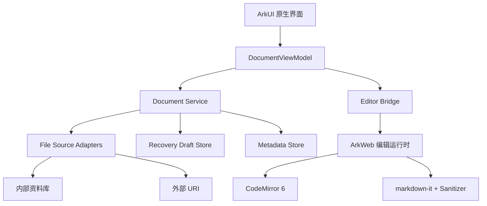
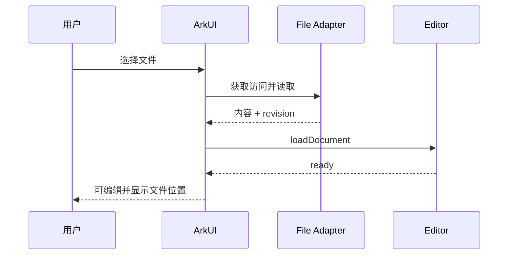
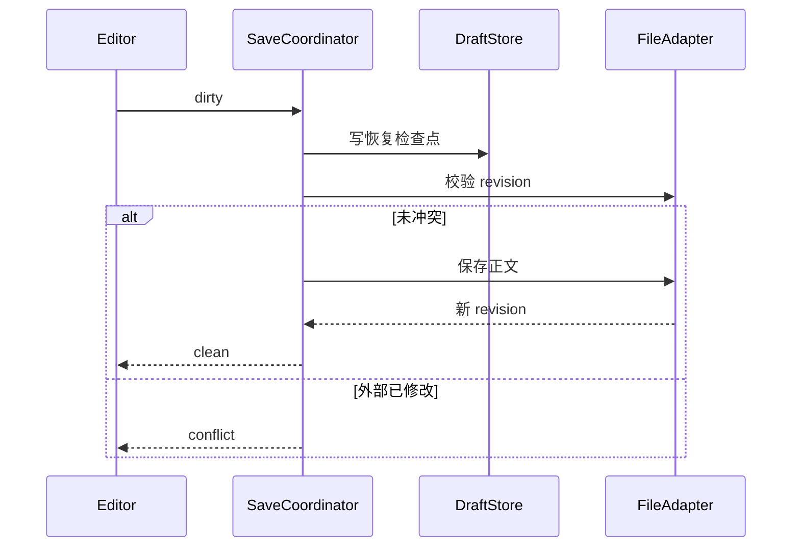

# Harmony Markdown Workbench

> HarmonyOS 原生 Markdown 文件工作台——SDD 规格、实施拆分与验收标准

| 项目属性 | 内容 |
|---|---|
| 文档版本 | 1.0.0 |
| 文档状态 | 可进入技术验证与开发 |
| 目标平台 | HarmonyOS 手机、平板；PC/2in1 预留完整工作区 |
| 开发方式 | Specification-Driven Development（SDD）|
| 主要执行者 | ZCode / AI Coding Agent + 人工评审 |
| 产品原则 | 打开的是原文件，保存后仍是原文件 |

---

## 0. 如何使用本文档

本文档既是产品规格，也是交给 ZCode 的执行合同。开发过程中遵循以下顺序：

1. 读取第 1～8 章，确认边界、术语、用户故事和验收口径。
2. 先完成 `M0 技术尖峰`，不得直接开始大面积页面开发。
3. 按第 13 章任务编号逐项实现，每个任务单独提交。
4. 每个任务提交时附：变更文件、设计说明、测试结果、已知限制。
5. 自动化验收不通过时，不得用“手工看起来正常”代替。
6. 若实际 HarmonyOS SDK 接口与本文假设不一致，先更新规格中的 ADR，再修改实现。

本文档中的 `MUST`、`SHOULD`、`MAY` 分别表示必须、建议和可选。

---

# 第一部分：产品规格

## 1. 产品定义

### 1.1 一句话定位

面向开发者、技术写作者和本地文档用户的鸿蒙原生 Markdown 文件工作台：无需账号，以标准 Markdown 文件为唯一真源，在手机快速编辑、平板分屏预览，并为 PC/2in1 提供文件夹工作区能力。

### 1.2 核心价值

- 文件属于用户，不转换为私有笔记数据库。
- 能从系统文件管理器打开 `.md/.markdown/.txt` 并原位保存。
- 用户随时知道文件位置、保存状态和异常恢复状态。
- 编辑、预览、分享、附件处理在鸿蒙设备上形成闭环。
- 手机不是桌面编辑器的缩小版，平板也不是简单拉伸。

### 1.3 差异化

本产品不是：

- 鸿蒙版 Obsidian：首版不做双链、知识图谱、插件市场。
- 简化版思源：不采用内部块数据库作为文档真源。
- AI 写作工具：AI 不进入首版主路径。
- 云笔记：首版不要求登录、不自建同步服务。
- 富文本编辑器：Markdown 源码始终是唯一真源。

### 1.4 成功指标

首版发布后关注：

| 指标 | 目标 |
|---|---:|
| 冷启动至可输入 | 中端设备 P95 ≤ 1.5 秒 |
| 最近文件打开成功率 | ≥ 99.9% |
| 正常编辑会话数据丢失率 | 0 |
| 崩溃草稿恢复成功率 | ≥ 99% |
| 1 MB Markdown 首次预览 | P95 ≤ 800 ms |
| 连续输入主线程明显卡顿 | 0 次；输入响应 P95 ≤ 50 ms |
| 外部冲突静默覆盖 | 0 次 |

指标采集不得上传文档正文、路径、文件名或用户输入内容。

---

## 2. 用户与场景

### 2.1 目标用户

#### Persona A：鸿蒙开发者

- 经常查看或修改 README、设计文档、日志和配置说明。
- 文件可能来自 Git 仓库、聊天应用、邮件或文件管理器。
- 需要源码模式、代码块、搜索、快捷键和准确保存。

#### Persona B：技术写作者

- 使用 Markdown 写博客、教程、会议记录和产品文档。
- 关心目录大纲、图片、长文性能、导出与恢复。

#### Persona C：跨设备本地文档用户

- 手机上快速修改，平板上进行长文编辑，PC 上管理目录。
- 不希望文档被锁进某个应用账号或专有数据库。

### 2.2 首版核心场景

1. 用户从系统文件管理器选择一个 Markdown 文件并开始编辑。
2. 用户从其他应用“用本应用打开”Markdown 附件。
3. 用户在应用内资料库新建 Markdown 文件。
4. 用户编辑时切换到预览或平板分屏预览。
5. 应用切后台、被杀死或异常退出后恢复未保存草稿。
6. 外部程序修改了当前文件，应用提示冲突而不是直接覆盖。
7. 用户将文档作为原始 Markdown 文件分享出去。

### 2.3 非目标用户

- 需要复杂团队协同和多人实时编辑的团队。
- 以数据库、表格视图、知识图谱为核心的 PKM 用户。
- 需要 Word 级排版、审阅和修订功能的办公用户。
- 需要完整学术出版工具链的 LaTeX/Pandoc 专业用户。

---

## 3. 范围与版本规划

### 3.1 V0.1 MVP：文件闭环

MUST：

- 应用内资料库。
- 新建、重命名、删除资料库文档。
- 系统文件选择器打开外部 `.md/.markdown/.txt`。
- 外部文件原位保存。
- 编辑、预览、平板分屏三种模式。
- GFM 基础渲染：标题、列表、任务列表、表格、引用、链接、图片、代码块、删除线。
- 自动保存、明确保存状态。
- 崩溃草稿恢复。
- 外部修改冲突检测。
- 最近文件、固定文件。
- 当前文档目录大纲。
- 文档内查找与替换。
- 系统分享和“用其他应用打开”。
- 深浅色主题。
- 手机、平板响应式布局。
- 物理键盘常用快捷键。

### 3.2 V0.2：工作台增强

SHOULD：

- 图片插入与附件目录。
- Markdown + 附件打包导出。
- 本地历史版本。
- PC/2in1 文件夹工作区。
- 全文检索。
- 多标签页。
- 快速打开文件。
- HTML/PDF 导出。

### 3.3 V1.0 之后候选能力

MAY：

- WebDAV、Git、华为云空间等可选同步。
- Mermaid、KaTeX。
- Front Matter 编辑面板。
- 自定义 CSS。
- 开放扩展协议。

### 3.4 明确排除

V0.1/V0.2 不实现：

- AI 写作、摘要、改写。
- 用户账号和服务端。
- 双链、块引用、知识图谱。
- 插件市场。
- 在线多人协作。
- 所见即所得富文本。
- 日历、任务提醒和复杂 Todo 系统。

---

## 4. 信息架构与页面

### 4.1 页面结构

```text
启动
└── 首页
    ├── 最近文件
    ├── 固定文件
    ├── 应用内资料库
    ├── 新建文档
    ├── 打开外部文件
    └── 设置
        ├── 编辑器
        ├── 外观
        ├── 自动保存
        ├── 数据与恢复
        └── 关于与开源许可

编辑页
├── 顶部栏：返回 / 文件名 / 保存状态 / 更多
├── 编辑器
├── 预览器
├── 大纲抽屉
├── 查找替换条
└── 移动端 Markdown 快捷栏
```

### 4.2 不同设备布局

| 设备 | 默认体验 |
|---|---|
| 手机 | 单栏；编辑与预览快速切换；底部快捷栏 |
| 平板竖屏 | 单栏或用户选择分屏 |
| 平板横屏 | 默认编辑/预览分屏；大纲侧栏 |
| PC/2in1 V0.1 | 自适应大屏；键鼠快捷键 |
| PC/2in1 V0.2 | 文件树 + 编辑区 + 预览/大纲，多标签 |

布局断点必须由窗口宽度决定，不能仅根据设备类型硬编码。

---

## 5. 功能需求

### 5.1 文件来源模型

系统必须区分两种文件来源：

```ts
type DocumentSource =
  | { kind: 'internal'; relativePath: string }
  | { kind: 'external'; uri: string; displayName: string };
```

#### FR-FILE-001 内部资料库

- 应用私有目录保存标准 Markdown 文件。
- 元数据数据库只保存索引，不保存正文作为唯一副本。
- 用户能够导出任意文档原文件。
- 删除操作进入应用回收站，默认保留 30 天。

验收：

- 创建后可在应用重启后继续打开。
- 导出的字节内容与当前编辑内容一致。
- 删除后可从回收站恢复，路径冲突时不得覆盖已有文件。

#### FR-FILE-002 外部文件打开

- 使用系统文件选择能力，仅展示支持类型。
- 保存可持久化的 URI 或访问令牌；具体 API 由 M0 验证。
- 若持久权限不可用，明确标记“临时访问”，不得伪装为可长期恢复。
- 最近文件中权限失效时提供“重新定位”。

验收：

- 从至少两个系统文件来源打开文件成功。
- 重启后仍能打开已授权文件；若系统不允许，进入可恢复错误态。
- 不把外部文件无提示复制成内部文件继续编辑。

#### FR-FILE-003 编码与换行

- V0.1 MUST 支持 UTF-8、UTF-8 BOM。
- 读取时识别 LF/CRLF，保存时默认保持原换行风格。
- 非 UTF-8 文件提示用户选择“只读打开”或“转换副本”。
- 不允许静默乱码后保存覆盖。

#### FR-FILE-004 文件变更检测

打开文件时记录：

```ts
interface FileRevision {
  size: number;
  modifiedTime?: number;
  contentHash: string;
}
```

- 保存前比较磁盘版本与基线版本。
- 修改时间不可用或不可靠时必须使用内容哈希兜底。
- 检测到外部变化时停止自动保存。

冲突界面提供：

1. 查看磁盘版本。
2. 保留当前内容为副本。
3. 使用磁盘版本重新加载。
4. 确认后覆盖磁盘版本。

禁止默认选择覆盖。

### 5.2 编辑器

#### FR-EDIT-001 编辑核心

- 使用 CodeMirror 6 或经 ADR 批准的等价编辑器。
- 支持 Markdown 语法高亮、行号开关、自动换行、撤销重做。
- 撤销栈在单次编辑会话内有效。
- 预览切换后保留光标、选区和滚动位置。
- 大文档不得每次输入都把全文同步到 ArkTS。

#### FR-EDIT-002 移动端快捷栏

默认按钮：

- 标题。
- 加粗、斜体、删除线。
- 链接、图片。
- 无序列表、有序列表、任务列表。
- 引用、行内代码、代码块。
- 撤销、重做。

要求：

- 点击操作必须作用于当前选区。
- 包裹型语法执行后保持合理选区或光标位置。
- 空选区时插入可继续输入的模板。
- 快捷栏不得遮挡系统输入法候选区域。

#### FR-EDIT-003 列表续行

- 回车自动延续无序、有序和任务列表。
- 空列表项再次回车结束列表。
- 有序列表后续编号自动递增。
- Tab/Shift+Tab 调整缩进，仅在适用上下文生效。

#### FR-EDIT-004 查找替换

- 支持大小写敏感开关、全词匹配、上一个/下一个。
- 替换当前和全部替换。
- 大文档搜索不得阻塞 UI 主线程超过 100 ms。

### 5.3 预览

#### FR-PREVIEW-001 渲染

- 使用 markdown-it 或经 ADR 批准的兼容解析器。
- 所有 JS、CSS 和字体资源随应用本地打包，离线可用。
- 禁止 Markdown 中的脚本执行。
- 默认过滤危险 HTML、`javascript:` URL 和不安全 iframe。
- 外部链接点击前交由原生层确认和跳转。

#### FR-PREVIEW-002 滚动同步

- 分屏模式下，以编辑器可见首段为锚点同步预览。
- 用户正在主动滚动预览时，短暂暂停编辑器驱动同步。
- 同步逻辑尽量在 ArkWeb 内完成，避免高频跨桥消息。

#### FR-PREVIEW-003 大纲

- 从解析结果生成 H1～H6 大纲。
- 点击大纲定位编辑器对应标题。
- 相同标题生成稳定且唯一的内部 ID。
- 文档变化后增量或防抖更新，不能每次按键同步刷新原生侧栏。

### 5.4 保存与恢复

#### FR-SAVE-001 保存状态机

```text
CLEAN
  └─ 编辑 → DIRTY
DIRTY
  ├─ 自动/手动保存 → SAVING
  └─ 外部变化 → CONFLICT
SAVING
  ├─ 成功 → CLEAN
  └─ 失败 → ERROR
ERROR
  ├─ 重试 → SAVING
  └─ 外部变化 → CONFLICT
CONFLICT
  └─ 用户决策 → CLEAN 或 DIRTY
```

编辑页必须明确显示：已保存、保存中、未保存、保存失败、外部冲突。

#### FR-SAVE-002 自动保存

- 默认开启，编辑停止 1.5 秒后触发。
- 连续输入时最长 10 秒写入一次恢复草稿，但不强制频繁写外部文件。
- 同一文件的保存请求串行执行。
- 新保存请求到达时，过期未开始请求可合并。
- 应用进入后台时尝试刷新草稿；外部文件写入失败不得丢弃草稿。

#### FR-SAVE-003 写入策略

内部文件：

1. 写临时文件。
2. flush/fsync（SDK 支持时）。
3. 原子替换目标文件。
4. 更新 revision 基线。

外部 URI：

- 优先采用提供方支持的安全写入方式。
- 若只能覆盖写，写入前确保恢复草稿已落盘。
- 写失败保留编辑缓存和草稿，不更新基线。

#### FR-SAVE-004 草稿日志

```ts
interface RecoveryDraft {
  documentId: string;
  sourceFingerprint: string;
  baseRevision: FileRevision;
  content: string;
  updatedAt: number;
  appVersion: string;
}
```

- 草稿只保存在应用私有目录。
- 成功保存后延迟清理对应草稿。
- 启动时若草稿比磁盘版本新，进入恢复流程。
- 恢复界面必须允许预览草稿、磁盘版本和另存副本。

### 5.5 最近文件与元数据

元数据可以保存到 RDB/Preferences，但正文不得只存在数据库。

```ts
interface DocumentRecord {
  id: string;
  source: DocumentSource;
  title: string;
  lastOpenedAt: number;
  pinned: boolean;
  lastKnownRevision?: FileRevision;
  editorState?: {
    cursorAnchor: number;
    cursorHead: number;
    scrollTop: number;
    viewMode: 'edit' | 'split' | 'preview';
  };
}
```

- 最近文件默认最多显示 30 条。
- 固定文件不受最近列表淘汰影响。
- 不存储外部文件正文用于搜索或遥测。

### 5.6 分享

- 分享原始 Markdown 文件。
- 分享纯文本内容。
- V0.1 可选分享渲染后的 HTML；若未完成则不显示入口。
- 分享前必须确保最新内容已保存，或明确询问是否分享未保存副本。

---

## 6. 非功能需求

### 6.1 性能基线

统一测试样本：

| 样本 | 内容 |
|---|---|
| S1 | 10 KB 普通文档 |
| S2 | 1 MB，含 500 个标题、100 个代码块 |
| S3 | 5 MB 纯文本/Markdown 混合 |
| S4 | 1 MB，含 100 张本地图片引用 |

验收目标：

- S1 冷启动打开至可编辑 P95 ≤ 1.5 秒。
- S2 打开至可编辑 P95 ≤ 2.5 秒。
- S2 首次预览 P95 ≤ 800 ms。
- S2 连续输入 60 秒，输入响应 P95 ≤ 50 ms。
- S3 必须可打开、搜索、保存，不崩溃；可降级关闭实时预览。
- 内存不足时提示并降级，不允许静默丢失编辑内容。

实际设备型号、系统版本、构建类型必须记录在性能报告中。

### 6.2 稳定性

- 所有文件写入路径都有失败分支。
- 任意异常退出后，最多丢失最近 10 秒尚未落盘的输入；目标为 0。
- ArkWeb 崩溃后原生层保留最新草稿，并可重建编辑器。
- 打开损坏、超大、无权限或已删除文件不得导致应用崩溃。

### 6.3 隐私与安全

- 默认完全离线。
- V0.1 不申请 INTERNET，除非远程图片需求经 ADR 批准。
- 不上传正文、路径、文件名、剪贴板或附件。
- Web 资源只从应用包加载。
- Markdown HTML 必须经过白名单过滤。
- 外链必须校验 scheme。
- 日志不得输出完整正文、文件 URI、用户目录和访问令牌。

### 6.4 无障碍

- 所有图标按钮有可读标签。
- 保存状态不能只依赖颜色。
- 支持系统字体缩放。
- 关键按钮触控区域不小于平台推荐值。
- 物理键盘可以完成打开、保存、查找、切换视图和关闭弹窗。

### 6.5 可维护性

- 文件访问、编辑器桥接、渲染、元数据、恢复模块相互解耦。
- 核心状态机和文件逻辑必须有单元测试。
- Web 依赖固定版本并保留开源许可证。
- 不允许把业务逻辑集中在单个 Page 或单个 WebBridge 文件中。

---

# 第二部分：技术规格

## 7. 总体架构



### 7.1 原生层职责

- 页面和自适应布局。
- 系统文件选择、URI 权限、文件读写。
- 保存状态机、草稿、冲突检测。
- 最近文件和设置。
- 系统分享、窗口和生命周期。
- 向 Web 层发送低频命令及接收必要状态。

### 7.2 Web 编辑运行时职责

- 文本编辑、选区、撤销重做。
- Markdown 高亮。
- Markdown 解析和安全预览。
- 编辑/预览滚动同步。
- 编辑器命令、快捷栏操作。
- 防抖生成大纲和内容变更事件。

### 7.3 禁止的架构模式

- 每次按键将完整文档通过 JSBridge 传给 ArkTS。
- 原生层与 Web 层各维护一份可独立修改的正文。
- 直接把 Markdown 未过滤 HTML 注入可执行 Web 页面。
- 用数据库正文覆盖外部文件作为“恢复”。
- 在 View 中直接调用所有文件 API。

---

## 8. 模块与接口

### 8.1 建议目录

```text
entry/src/main/ets/
├── pages/
│   ├── HomePage.ets
│   ├── EditorPage.ets
│   └── SettingsPage.ets
├── components/
│   ├── SaveStatus.ets
│   ├── RecentFiles.ets
│   ├── MarkdownToolbar.ets
│   ├── OutlinePanel.ets
│   └── ConflictDialog.ets
├── domain/
│   ├── document/
│   ├── recovery/
│   └── settings/
├── services/
│   ├── DocumentService.ets
│   ├── SaveCoordinator.ets
│   ├── ConflictDetector.ets
│   ├── ShareService.ets
│   └── EditorBridge.ets
├── infrastructure/
│   ├── file/InternalFileSource.ets
│   ├── file/ExternalUriFileSource.ets
│   ├── metadata/MetadataStore.ets
│   └── recovery/DraftStore.ets
└── web/
    ├── index.html
    ├── editor.ts
    ├── preview.ts
    ├── bridge.ts
    └── styles/
```

实际目录可根据工程规范调整，但层次职责必须保留。

### 8.2 文件适配器接口

```ts
interface DocumentFileAdapter {
  read(source: DocumentSource): Promise<ReadDocumentResult>;
  write(
    source: DocumentSource,
    content: string,
    expectedRevision: FileRevision
  ): Promise<WriteDocumentResult>;
  stat(source: DocumentSource): Promise<FileRevision>;
  canPersistAccess(source: DocumentSource): Promise<boolean>;
}

interface ReadDocumentResult {
  content: string;
  encoding: 'utf-8' | 'utf-8-bom';
  lineEnding: 'lf' | 'crlf';
  revision: FileRevision;
}

type WriteDocumentResult =
  | { ok: true; revision: FileRevision }
  | { ok: false; reason: 'permission' | 'conflict' | 'io' | 'not_found'; message: string };
```

### 8.3 编辑会话

```ts
interface DocumentSession {
  record: DocumentRecord;
  baseRevision: FileRevision;
  saveState: 'clean' | 'dirty' | 'saving' | 'error' | 'conflict';
  lastSavedAt?: number;
  lastDraftAt?: number;
  error?: DomainError;
}
```

正文主副本位于 CodeMirror 文档模型。原生层通过以下时机取得正文：

- 防抖草稿检查点。
- 用户手动保存。
- 自动保存触发。
- 进入后台。
- 分享前。

### 8.4 JSBridge 协议

所有消息必须包含协议版本和请求 ID：

```ts
interface BridgeEnvelope<T> {
  version: 1;
  id: string;
  type: string;
  payload: T;
}
```

原生到 Web：

- `editor.loadDocument`
- `editor.getSnapshot`
- `editor.applyCommand`
- `editor.setTheme`
- `editor.setViewMode`
- `editor.find`
- `editor.replace`
- `editor.restoreState`

Web 到原生：

- `editor.ready`
- `editor.dirtyChanged`
- `editor.snapshot`
- `editor.outlineChanged`
- `editor.cursorChanged`（限频）
- `editor.externalLinkRequested`
- `editor.runtimeError`

约束：

- 内容传输必须按请求发生，禁止每次输入推送全文。
- 大纲事件防抖时间不少于 300 ms。
- 高频光标事件每秒不超过 10 次。
- 未知消息类型记录安全日志并忽略，不得崩溃。

---

## 9. 状态与流程

### 9.1 打开外部文件



失败处理：

- 权限拒绝：停留首页并解释用途。
- 文件已删除：提供从最近列表移除或重新定位。
- 编码不支持：只读打开或转换副本。
- 文件过大：提示并允许关闭实时预览后继续。

### 9.2 自动保存



### 9.3 启动恢复

1. 扫描未完成会话和草稿索引。
2. 比较草稿时间、基线 revision 和磁盘 revision。
3. 完全一致且磁盘内容已包含草稿时，清理冗余草稿。
4. 草稿更新但磁盘未更新时，提示恢复。
5. 草稿和磁盘都变化时，进入冲突恢复，不自动合并。

---

## 10. 决策记录 ADR

### ADR-001：编辑器采用 ArkWeb + CodeMirror 6

- 状态：建议接受，M0 后确认。
- 原因：成熟输入法、选择、撤销、语法高亮和扩展生态。
- 代价：需要严格桥接协议和 Web 安全策略。
- 被拒方案：纯 ArkTS 自研文本编辑器，首版成本和输入稳定性风险过高。

### ADR-002：Markdown 源码为唯一真源

- 状态：接受。
- 原因：保证文件兼容和用户所有权。
- 代价：首版不实现 WYSIWYG。

### ADR-003：内部库和外部 URI 双模式

- 状态：建议接受，M0 后确认。
- 原因：移动端无法完全复制桌面任意目录工作区。
- 代价：需要向用户解释两种来源和权限差异。

### ADR-004：首版不做云同步

- 状态：接受。
- 原因：降低账号、冲突、隐私和服务端成本。
- 代价：跨设备依赖系统分享或用户现有文件同步方案。

### ADR-005：预览使用成熟 JS 解析器

- 状态：建议接受。
- 原因：GFM 完整度和维护成本优于自研 ArkTS 解析器。
- 代价：需要本地资源打包和 HTML 安全过滤。

---

# 第三部分：SDD 执行计划

## 11. SDD 阶段与门禁

### 11.1 阶段 0：Constitution

ZCode 在任何实现中必须遵守：

1. 不丢数据优先于功能数量。
2. 标准文件优先于内部数据库便利性。
3. 冲突时停止写入，用户决策优先。
4. 离线和隐私为默认状态。
5. 先测试领域逻辑，再接 UI。
6. 每个任务保持可构建、可回退、可独立验收。
7. 禁止顺手添加 AI、账号、云同步、双链等范围外功能。
8. 引入新依赖前记录许可证、包体和维护状态。

### 11.2 阶段 1：Specify

输入：本文档。

输出：

- `/docs/spec/product-spec.md`：从本文档提取的稳定产品规格。
- `/docs/spec/acceptance.md`：需求 ID 到测试用例的映射。
- `/docs/adr/`：技术决策记录。
- `/docs/risks.md`：风险、负责人、截止时间。

门禁：所有 P0 需求必须有唯一 ID 和至少一个验收用例。

### 11.3 阶段 2：Clarify

仅允许提出会改变架构或验收的疑问。无用户答复时使用本文默认值，并记录为假设，不得无限等待。

必须澄清/验证：

- 目标 HarmonyOS SDK/API 版本。
- 手机、平板、PC/2in1 的实际发布范围。
- 外部 URI 持久访问能力和限制。
- ArkWeb 对目标版本的 IME、剪贴板、文件加载支持。
- 应用市场对外部脚本、远程图片和文件权限的要求。

### 11.4 阶段 3：Plan

输出：

- 模块依赖图。
- 里程碑和任务清单。
- 测试计划。
- 性能测试数据集生成脚本。
- CI 构建与静态检查命令。

门禁：M0 的验证方案必须能在真机执行，不接受仅模拟器结论。

### 11.5 阶段 4：Tasks

使用第 13 章任务。每个任务必须包含：

- 目标和非目标。
- 前置依赖。
- 修改文件。
- 实现策略。
- 自动化测试。
- 手工验收。
- 回滚方式。

### 11.6 阶段 5：Implement

- 一次只执行一个任务。
- 先阅读相关规格和现有实现。
- 先补测试或测试桩，再写生产代码。
- 完成后运行本任务和回归测试。
- 不得修改无关模块。

### 11.7 阶段 6：Validate

- 需求追踪矩阵全部闭环。
- 自动化测试通过。
- 真机异常测试通过。
- 性能达到门槛或形成批准的豁免 ADR。
- 开源许可证清单完整。

---

## 12. 开发环境与验证命令

ZCode 第一次进入真实仓库后必须检查并补全本节，不得凭空假设脚本名称。

建议命令：

```bash
# 搜索项目配置与现有测试
rg --files -g 'build-profile.json5' -g 'oh-package.json5' -g '*test*' -g 'hvigor*'

# Linux/macOS 构建示例，实际以项目 wrapper 为准
./hvigorw clean
./hvigorw assembleHap

# Windows 构建示例
hvigorw.bat clean
hvigorw.bat assembleHap
```

仓库必须在 `README.md` 中提供可复制执行的：

- 安装依赖命令。
- Debug 构建命令。
- 单元测试命令。
- UI 测试命令。
- Lint/静态检查命令。
- Web 编辑器构建与资源拷贝命令。

验收时若命令不可重复执行，视为未完成。

---

## 13. 任务拆分

## M0：技术尖峰与仓库基线

### TASK-M0-01 工程基线

目标：建立最小可构建 HarmonyOS 工程和质量门禁。

实现：

- 确定 bundle、target SDK、minimum SDK 和设备类型。
- 建立 `domain/services/infrastructure/pages/web` 分层。
- 配置格式化、静态检查、单元测试和 CI。
- README 写明所有构建命令。

验收：

- 全新环境按 README 可以构建 Debug HAP。
- 单元测试空套件/示例套件可执行。
- CI 在无缓存环境成功。
- 仓库不包含签名密码、证书或用户绝对路径。

### TASK-M0-02 外部文件 URI 尖峰

目标：验证选择、读取、重启后再次访问、原位保存和权限失效。

实验矩阵：

| 场景 | 手机 | 平板 | PC/2in1 |
|---|---|---|---|
| 系统文件管理器 | 必测 | 必测 | 必测/预留 |
| 下载目录 | 必测 | 必测 | 必测/预留 |
| 第三方文件提供方 | 至少 1 个 | 至少 1 个 | 可选 |
| 重启后读取 | 必测 | 必测 | 必测/预留 |
| 原位覆盖保存 | 必测 | 必测 | 必测/预留 |
| 文件被移动/删除 | 必测 | 必测 | 必测/预留 |

输出：`docs/spikes/external-uri.md`，记录 API、权限、设备、失败码和结论。

门禁：若无法可靠持久访问，产品必须显示“临时访问”，最近文件改为重新定位流程。

### TASK-M0-03 ArkWeb 编辑器尖峰

目标：验证 CodeMirror 6、中文输入法、长文、桥接和生命周期。

必测：

- 中文拼音连续输入 5 分钟。
- 组合输入期间不触发错误自动保存。
- 剪切、复制、粘贴、选择、撤销重做。
- 1 MB、5 MB 文档打开和输入。
- 切后台/前台、旋转、窗口改变。
- ArkWeb 进程异常后的恢复路径。

输出：`docs/spikes/editor-runtime.md` 和性能数据。

### TASK-M0-04 保存恢复尖峰

目标：先证明“不会丢稿”。

实现一个无正式 UI 的测试页，覆盖：

- 内部原子写。
- 外部 URI 写失败。
- 草稿检查点。
- 保存状态机。
- 外部冲突检测。
- 强杀进程后恢复。

门禁：核心异常用例全部通过后才能开始 M2 编辑页面。

---

## M1：领域模型与文件基础

### TASK-M1-01 DocumentSource 与文件适配器

依赖：M0-02。

验收：

- 内部和外部适配器通过同一契约测试。
- UTF-8、BOM、LF、CRLF 用例通过。
- 空文件、无权限、文件不存在、磁盘写失败都有明确结果。

### TASK-M1-02 元数据与最近文件

验收：

- 正文不写入元数据数据库。
- 最近列表排序、固定、淘汰逻辑有单测。
- URI 权限失效不会造成启动崩溃。

### TASK-M1-03 内部资料库

验收：

- 新建、重命名、软删除、恢复成功。
- 文件名校验防止目录穿越和非法路径。
- 重名提供取消、自动改名或明确覆盖选择。

---

## M2：编辑器闭环

### TASK-M2-01 Web 编辑器资源

依赖：M0-03。

验收：

- CodeMirror 和所有资源本地加载。
- 无网络时完整可用。
- 编辑、选区、撤销重做和主题切换通过测试。
- 第三方依赖版本和许可证进入 NOTICE。

### TASK-M2-02 Bridge 协议

验收：

- 协议版本、请求 ID、超时和错误返回实现完整。
- 未知消息、重复回包、Web 未就绪均不崩溃。
- 连续输入不会逐键传输全文。

### TASK-M2-03 EditorPage

验收：

- 打开内部/外部文件后内容准确。
- 返回时有未保存状态保护。
- 旋转和窗口调整不丢光标、选区和正文。
- TalkBack/屏幕阅读可识别主要操作。

### TASK-M2-04 Markdown 快捷栏和键盘快捷键

验收：

- 每个命令均覆盖空选区和非空选区。
- Ctrl/Cmd+S、F、Z、Shift+Z 或平台等价快捷键有效。
- 输入法弹出时快捷栏不遮挡编辑区域关键内容。

---

## M3：预览、大纲与搜索

### TASK-M3-01 安全 Markdown 预览

验收语料必须包含：

- GFM 表格、任务列表、删除线。
- 嵌套列表和引用。
- 围栏代码和语言标识。
- 本地图片、相对链接、外部链接。
- `<script>`、事件属性、`javascript:` URL、危险 iframe。

验收：危险内容不执行，普通 Markdown 渲染结果符合快照。

### TASK-M3-02 分屏与滚动同步

验收：

- 100 个标题文档滚动定位误差不超过一个可视段落。
- 用户手动滚动预览时不发生明显抢滚。
- 开关同步不影响文档内容。

### TASK-M3-03 大纲

验收：

- H1～H6 层级正确。
- 重名标题可独立定位。
- 快速连续输入时侧栏不高频抖动。

### TASK-M3-04 查找替换

验收：

- 大小写、全词、替换当前、全部替换正确。
- 替换操作可以一次撤销。
- S2 搜索无明显 UI 卡顿。

---

## M4：保存、冲突和恢复

### TASK-M4-01 SaveCoordinator

依赖：M0-04、M1-01、M2-02。

验收：

- 状态迁移单元测试覆盖全部合法和非法路径。
- 并发保存被正确串行或合并。
- 保存失败后仍保持 dirty/error，不显示已保存。

### TASK-M4-02 自动保存

验收：

- 防抖时间符合设置。
- 持续输入期间草稿检查点不超过 10 秒。
- 冲突状态下自动保存停止。
- 前后台切换不发生重复覆盖。

### TASK-M4-03 冲突处理

测试：

1. 应用打开文件 A。
2. 用户在应用内编辑。
3. 外部工具修改 A。
4. 应用尝试保存。

验收：

- 应用进入冲突态。
- 磁盘内容未被覆盖。
- 当前编辑内容仍存在。
- 四种用户决策均有确定结果和测试。

### TASK-M4-04 崩溃恢复

验收：

- dirty 状态强杀后重启出现恢复入口。
- 恢复前不自动覆盖磁盘文件。
- 保存成功后的旧草稿不会重复提示。
- 损坏草稿被隔离并可安全删除。

---

## M5：首页、分享和设置

### TASK-M5-01 首页

验收：

- 主要入口只有“新建文档”和“打开文件”，认知清晰。
- 最近、固定和内部资料库状态正确。
- 空态能够解释文件存储模式。

### TASK-M5-02 分享

验收：

- 可分享原始 Markdown。
- dirty 文档分享前行为符合规格。
- 分享临时文件会在合理时间清理，不删除源文件。

### TASK-M5-03 设置

包含：主题、字号、自动换行、行号、自动保存、默认视图、恢复草稿管理。

验收：设置重启后保持；非法值回退默认值；修改主题不重载并丢失正文。

---

## M6：多设备适配与发布质量

### TASK-M6-01 响应式布局

验收窗口宽度至少覆盖：手机窄屏、手机横屏、平板竖屏、平板横屏、自由窗口。

- 不出现工具栏越界。
- 分屏比例可以拖动或使用合理固定比例。
- 窗口缩放过程中正文和编辑状态不丢失。

### TASK-M6-02 性能优化

依照第 6.1 节执行测试，输出 `docs/reports/performance-v0.1.md`。

任何未达标项必须包含：测量数据、根因、修复方案或批准的降级策略。

### TASK-M6-03 安全与隐私检查

验收：

- 无非必要 INTERNET 权限。
- 日志脱敏测试通过。
- HTML 安全语料通过。
- 依赖漏洞和许可证扫描完成。
- 隐私说明与实际行为一致。

### TASK-M6-04 发布候选版本

验收：

- 全量测试通过。
- 不存在 P0/P1 未关闭缺陷。
- P2 缺陷有明确说明和计划。
- 安装、升级、卸载、数据保留策略验证完成。
- Release 构建无调试开关、测试菜单和密钥。

---

## 14. 需求追踪矩阵模板

ZCode 必须创建并持续更新：

| 需求 ID | 实现任务 | 单元测试 | 集成/UI 测试 | 真机验收 | 状态 |
|---|---|---|---|---|---|
| FR-FILE-001 | M1-03 | 待填写 | 待填写 | 待填写 | Todo |
| FR-FILE-002 | M0-02/M1-01 | 待填写 | 待填写 | 待填写 | Todo |
| FR-FILE-004 | M4-03 | 待填写 | 待填写 | 待填写 | Todo |
| FR-EDIT-001 | M0-03/M2-01 | 待填写 | 待填写 | 待填写 | Todo |
| FR-PREVIEW-001 | M3-01 | 待填写 | 待填写 | 待填写 | Todo |
| FR-SAVE-001 | M4-01 | 待填写 | 待填写 | 待填写 | Todo |
| FR-SAVE-004 | M4-04 | 待填写 | 待填写 | 待填写 | Todo |

所有 P0 需求状态达到 Done 后，版本才可标记为 Release Candidate。

---

## 15. 测试设计

### 15.1 单元测试

重点覆盖：

- 文件编码和换行检测。
- 内容哈希和 revision 比较。
- 保存状态机。
- 自动保存防抖和并发合并。
- 最近文件排序和淘汰。
- 文件名和路径校验。
- 草稿恢复决策。
- Bridge 消息解析。
- Markdown HTML 清理策略。

### 15.2 契约测试

内部和外部 `DocumentFileAdapter` 使用同一套测试：

- 读写一致。
- 空文件。
- 权限拒绝。
- 写入失败。
- 目标删除。
- 并发外部修改。
- BOM/LF/CRLF 保持。

### 15.3 UI 测试

- 首页新建到编辑保存闭环。
- 从系统文件选择器打开。
- 编辑/预览/分屏切换。
- 查找替换。
- 冲突对话框四种决策。
- 草稿恢复。
- 分享。
- 横竖屏和窗口切换。

### 15.4 破坏性测试

必须人工或自动执行：

- 保存时强杀应用。
- 保存时拔掉/断开文件提供方。
- 磁盘空间不足。
- 外部权限在编辑期间被撤销。
- 当前文件被重命名、移动、删除。
- 外部程序同时修改。
- ArkWeb 运行时异常。
- 5 MB 文档连续粘贴和撤销。
- 含恶意 HTML 的 Markdown。
- 系统字体放大和深浅色切换。

### 15.5 发布验收脚本

每个 Release Candidate 必须保留：

- 构建日志。
- 自动化测试报告。
- 设备与系统版本矩阵。
- 性能报告。
- 破坏性测试记录。
- 依赖与许可证清单。

---

## 16. Definition of Done

单个任务只有同时满足以下条件才算 Done：

- 对应需求和 ADR 没有冲突。
- 代码已实现，无伪实现、TODO 占位或静默吞错。
- 新增逻辑有自动化测试。
- 相关回归测试通过。
- 真机能力已按任务要求验证。
- 错误态和空态已实现。
- 无敏感日志、硬编码密钥和绝对路径。
- 文档、注释和开源许可已更新。
- 提交说明包含验证证据和已知限制。

项目 V0.1 只有同时满足以下条件才算完成：

- 所有 P0 功能验收通过。
- 外部文件可以可靠打开、修改和原位保存。
- 冲突不会静默覆盖。
- 强杀恢复测试通过。
- 性能达到第 6.1 节门槛或获得明确 ADR 豁免。
- Release HAP 在目标手机和平板真机安装运行。

---

## 17. 风险清单

| 风险 | 概率 | 影响 | 缓解措施 | 最晚验证 |
|---|---:|---:|---|---|
| 外部 URI 无法长期授权 | 高 | 高 | 临时访问标识、重新定位、内部副本显式选择 | M0-02 |
| ArkWeb 中文输入兼容问题 | 中 | 高 | 真机 IME 尖峰、固定编辑器版本、组合输入测试 | M0-03 |
| 外部文件无法原子替换 | 高 | 高 | 草稿先落盘、冲突检测、失败保留正文 | M0-04 |
| 大文档渲染卡顿 | 中 | 中高 | 防抖、Worker、关闭实时预览降级 | M0-03/M6-02 |
| Web 与原生状态不一致 | 中 | 高 | 单一正文真源、版本化 Bridge、请求式快照 | M2-02 |
| Markdown HTML 注入 | 中 | 高 | 默认禁 HTML 或严格 Sanitizer、离线 CSP | M3-01 |
| 图片相对路径受 URI 限制 | 高 | 中 | V0.1 明确限制，V0.2 设计附件目录和导出包 | V0.2 前 |
| 依赖许可证不兼容 | 低中 | 高 | 引入前审核、NOTICE、优先 MIT/BSD/Apache | 每次引入 |

---

## 18. 提交和分支建议

建议：

```text
main
├── feature/m0-external-uri-spike
├── feature/m0-editor-runtime-spike
├── feature/m1-document-adapters
├── feature/m2-editor-bridge
└── feature/m4-save-recovery
```

提交格式：

```text
feat(M2-02): implement versioned editor bridge
test(M4-01): cover invalid save-state transitions
docs(ADR-003): record external URI persistence limits
fix(M4-03): prevent overwrite after external modification
```

禁止一个提交同时完成多个无关 TASK。

---

## 19. 给 ZCode 的启动指令

将下面内容与本文档一起交给 ZCode：

```text
你正在实现 Harmony Markdown Workbench。

1. 完整阅读 HarmonyMarkdownWorkbench-SDD.md。
2. 当前只执行 TASK-M0-01，不要提前实现后续功能。
3. 先检查仓库现状、HarmonyOS SDK 版本、构建脚本、已有规范和测试。
4. 输出你对 TASK-M0-01 的理解、会修改的文件、验证命令和风险。
5. 如果没有阻塞性问题，直接实现，不要反复询问文档已有答案。
6. 完成后运行构建、测试和静态检查。
7. 最终报告必须包含：
   - 修改文件清单；
   - 关键设计决策；
   - 实际执行的命令及结果；
   - 未完成事项和已知限制；
   - 下一任务是否满足前置条件。
8. 不得增加 AI、云同步、账号、双链、插件等范围外功能。
9. 不得声称未实际运行的测试已经通过。
```

后续任务指令模板：

```text
执行 TASK-XXXX。

前置要求：
- 阅读该任务关联的 FR、NFR、ADR 和风险项。
- 检查前置任务是否真实完成。

执行要求：
- 只修改本任务必要范围。
- 先添加或更新测试，再实现功能。
- 遇到规格与 SDK 冲突时，先提交 ADR 更新建议。
- 完成后执行任务验收和相关回归测试。

交付格式：
1. 完成情况；
2. 修改文件；
3. 实现说明；
4. 测试证据；
5. 与验收点逐条对照；
6. 风险和遗留项。
```

---

## 20. 推荐里程碑

按一名熟悉鸿蒙开发的工程师全职估算：

| 里程碑 | 内容 | 估算 |
|---|---|---:|
| M0 | 工程、URI、编辑器、保存恢复尖峰 | 1～1.5 周 |
| M1 | 文件模型、资料库、最近文件 | 0.5～1 周 |
| M2 | 编辑器、Bridge、快捷栏 | 1～1.5 周 |
| M3 | 预览、大纲、搜索 | 0.5～1 周 |
| M4 | 保存、冲突、恢复正式实现 | 1～1.5 周 |
| M5 | 首页、设置、分享 | 0.5～1 周 |
| M6 | 多端、性能、安全、发布 | 1～1.5 周 |
| 合计 | V0.1 可发布 MVP | 6～9 周 |

AI 编码可以缩短样板代码时间，但不能缩短真机权限、输入法、异常保存和性能验证的必要时间。

---

## 21. V0.1 最终验收清单

### 文件

- [ ] 内部文档新建、重命名、删除、恢复。
- [ ] 外部文件打开和原位保存。
- [ ] UTF-8/BOM、LF/CRLF 正确处理。
- [ ] 权限失效、文件删除和移动有恢复路径。

### 编辑

- [ ] 中文输入、选择、剪贴板、撤销重做稳定。
- [ ] 快捷栏和物理键盘快捷键正确。
- [ ] 查找替换正确且可撤销。
- [ ] 旋转、切后台、窗口变化不丢内容。

### 预览

- [ ] GFM 核心语法正确。
- [ ] 恶意 HTML 不执行。
- [ ] 分屏和滚动同步可用。
- [ ] 大纲层级和跳转正确。

### 保存与恢复

- [ ] 保存状态准确。
- [ ] 自动保存串行且可恢复。
- [ ] 外部冲突不会静默覆盖。
- [ ] 强杀后草稿恢复成功。
- [ ] 写失败后正文仍然存在。

### 质量

- [ ] 构建、单测、UI 测试、静态检查通过。
- [ ] 性能样本通过或有批准的降级方案。
- [ ] 手机和平板真机通过。
- [ ] 无敏感权限、日志或密钥。
- [ ] 许可证和隐私说明完整。

---

## 22. 参考项目与技术资料

- CodeMirror 6：https://codemirror.net/
- markdown-it：https://github.com/markdown-it/markdown-it
- DOMPurify：https://github.com/cure53/DOMPurify
- Markor：https://github.com/gsantner/markor
- MarkText：https://github.com/marktext/marktext
- Obsidian 文件存储说明：https://help.obsidian.md/Files+and+folders/How+Obsidian+stores+data
- Harmony Markdown Editor：https://github.com/electronicminer/Harmony-Markdown-Editor
- SiYuan HarmonyOS：https://github.com/siyuan-note/siyuan-harmony

引用开源代码前必须重新核对许可证、版本、维护状态和分发义务，不得仅凭本列表直接复制。
