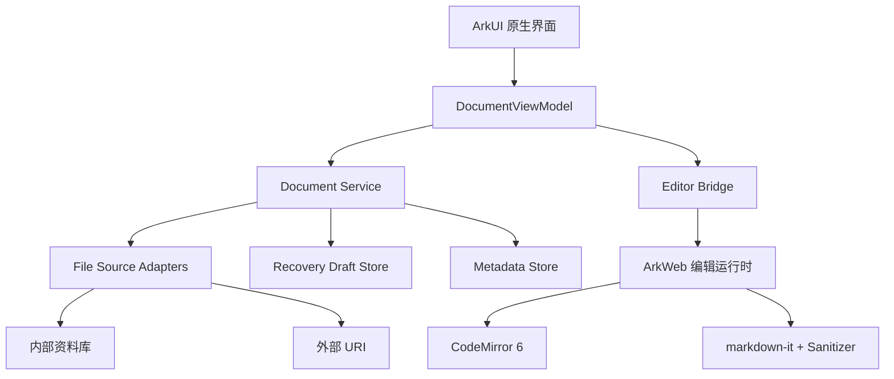

# 里程碑与任务计划

> 依 SDD 11.4（阶段 3 Plan）与 20 章里程碑估算。模块依赖图见下；每个任务的测试计划见 `docs/spec/acceptance.md`。

## 模块依赖图



依赖关系（任务级）：

- M0-02（URI 尖峰）→ M1-01（适配器契约测试）
- M0-03（编辑器尖峰）→ M2-01（Web 资源）→ M2-02（Bridge）→ M2-03/04
- M0-04（保存恢复尖峰）→ M4-01（SaveCoordinator）
- M1-01 + M1-02 + M1-03 相互独立，依赖 M0-02
- M2 依赖 M1-01（打开文件会话）；M3 依赖 M2-01（渲染运行时）
- M4-01 依赖 M0-04 + M1-01 + M2-02；M5 依赖 M1/M2 基础
- M6 覆盖全部前序任务收口

## 里程碑

| 里程碑 | 内容 | 估算 | 状态 |
|---|---|---|---|
| M0 | 工程 + URI + 编辑器 + 保存恢复尖峰 | 1～1.5 周 | M0-01 ✅ / M0-02 ✅ / M0-03 骨架 ✅（UI 矩阵待解锁）/ M0-04 领域层 ✅（真机待解锁） |
| M1 | 文件模型、资料库、最近文件 | 0.5～1 周 | 领域层先行 ✅（最近列表/文件名校验 13 用例） |
| M2 | 编辑器、Bridge、快捷栏 | 1～1.5 周 | 待启动 |
| M3 | 预览、大纲、搜索 | 0.5～1 周 | 待启动 |
| M4 | 保存、冲突、恢复正式实现 | 1～1.5 周 | 待启动 |
| M5 | 首页、设置、分享 | 0.5～1 周 | 待启动 |
| M6 | 多端、性能、安全、发布 | 1～1.5 周 | 待启动 |
| 合计 | V0.1 可发布 MVP | 6～9 周 | — |

## M0 任务清单与门禁

- **TASK-M0-01 工程基线** ✅（本次完成）：构建、单测、clean-build 门禁、README、文档基线。
  - 门禁项：全新环境按 README 构建 Debug HAP ✓；单测可执行 ✓；无缓存构建 ✓（clean-build 脚本）；无签名密钥入库 ✓。
- **TASK-M0-02 外部文件 URI 尖峰** ✅（2026-08-29 完成，真机 OpenHarmony 7.0.0.28）：
  - 完成：签名安装链路（sign-local.sh，官方 CA 体系）、选择器/读取/写/删除矩阵、**重启失效实测**（13900001，临时授权模型证实）、文档全量。
  - 门禁结论：无法可靠持久访问（R-10 类型缺失 + 13900001 实测）→ **产品按"临时访问+重新定位"交付**（ADR-009 草案）。
  - 输出：`docs/spikes/external-uri.md`。
- **TASK-M0-03 ArkWeb 编辑器尖峰**（待启动）：中文 IME 5 分钟、剪贴板/撤销、1MB/5MB、生命周期、进程异常；输出 `docs/spikes/editor-runtime.md` 与性能数据。
- **TASK-M0-04 保存恢复尖峰** ✅（2026-08-31 真机完成）：
  - ✅ 领域层完成并通过单测（27 用例）：SaveStateMachine（FR-SAVE-001 全路径）、FileRevisionCompare（FR-FILE-004）、DraftDecisionEvaluator（SDD 9.3 五规则）。
  - ✅ 真机实测：原子写/读回一致、URI 写失败（13900002→ERROR 状态）、草稿检查点、强杀恢复（决策"冗余可清理"）。见 docs/spikes/save-recovery.md。
  - 门禁：核心异常用例全部通过后才能开始 M2 编辑页面（状态机+冲突+草稿决策单测已过，真机项列入 M4 验收）。

## 测试计划（摘要）

- 单元测试：领域逻辑优先（SDD 15.1），hypium 本地执行；M4 状态机为主。
- 契约测试：内外部 `DocumentFileAdapter` 共用（SDD 15.2）。
- UI/真机测试：hypium 设备套件 + 手工验收；性能样本 S1–S4 生成脚本随 M6-02 提供。
- 破坏性测试清单：SDD 15.4（强杀、断提供方、磁盘满、权限撤销、文件移动/删除、并发修改、ArkWeb 异常、5MB 粘贴撤销、恶意 HTML、字体缩放/深浅色）。

## 构建与验证命令（已在 README 固化）

```bash
./hvigorw assembleHap --mode module -p product=default   # Debug HAP
./hvigorw test --mode module -p product=default          # 单元测试
bash scripts/clean-build.sh                              # 无缓存全量验证（门禁）
```